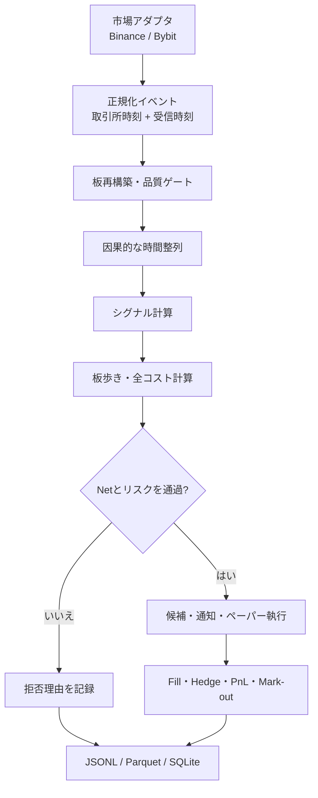

# 市場横断型・価格歪み検知システム 要件定義書

文書ID: `CMR-001`  
対象リポジトリ: `araiy555/bitcoin` / `jsboard`  
版: 1.0  
状態: 実装・検証基準  
対象: 個人が公開市場データで研究・ペーパートレードできる範囲

## 0. この文書の位置づけ

`SPEC.md` は現在の `jsboard` が「何を、どう実装しているか」を記述する一次資料である。
本書は、その上で市場横断型の裁定・相対価値・先行遅行を研究するときに必要な
データ、機能、判定式、品質基準、採用・棄却条件を定義する。

本書でいう「ジェーン・ストリート型」は特定企業の非公開戦略の再現ではない。
次の一般原則を個人向けの公開データ環境へ落としたものを指す。

- 単一銘柄の方向ではなく、同じ価値を表す複数市場の相対価格を見る
- 表示価格ではなく、注文数量を実際の板で執行できる価格を見る
- シグナルではなく、全費用・未約定・ヘッジ遅延後のNetで採否を決める
- 将来データを使わず、同じ入力から同じ結果を再現できるよう記録する
- 利益を保証せず、仮説を短い実験で棄却できるようにする

---

## 1. 目的と成功条件

### 1.1 目的

複数市場の公開データを同一の受信時計で収集し、次の機会をリアルタイムに検知・
記録・リプレイ評価する。

1. 同一無期限先物の取引所間価格差（Binance / Bybit）
2. 同一取引所の現物・無期限先物の相対価値
3. 先行市場の変化に対する遅行市場の未反映
4. 同一取引所内の三角裁定

### 1.2 システムとしての成功

次をすべて満たしたとき、システム完成とする。

- 板・約定・派生データを欠損と順序破壊を検知しながら記録できる
- 異なる市場を未来参照なしで同じ判断時点に揃えられる
- 指定数量の板歩きと全コストを含む `expected_net_bps` を算出できる
- すべての候補と拒否理由を保存し、同じ録画から決定を再現できる
- ペーパー約定、二脚の片張り、ヘッジ遅延、Fundingを会計できる
- 学習期間で設定を固定し、別期間のOut-of-sampleで採否を判定できる

### 1.3 戦略としての採用

短時間の黒字や高いZスコアだけでは採用しない。戦略ごとの詳細条件に加え、最低限、
次をすべて満たすこと。

- 全コスト後NetがOut-of-sampleで正
- 最低30取引。30未満は「未判定」であり合格ではない
- 最大ドローダウン、最大単発損失、片張り時間が設定上限内
- 収益が1日・1銘柄・上位少数取引だけに極端に集中していない
- 手数料、約定、遅延を不利側へ振ったストレス条件でも破綻しない

---

## 2. スコープ

### 2.1 第1フェーズ: 仮想通貨（実装対象）

- Binance Spot
- Binance USDⓈ-M Perpetual
- Bybit USDT Perpetual
- 公開REST / WebSocketのみ
- リアルタイム監視、録画、リプレイ、バックテスト、ペーパートレード、通知

既存の `capture`、`xcapture`、`xarb`、`dealer`、`pair`、`sweep`、`hedge` を再利用し、
不足している共通判定・データ品質・監査ログを追加する。

### 2.2 第2フェーズ: 日本株・ETF・先物（要件のみ）

初期実装には含めない。日経225先物、日経225連動ETF、構成銘柄を同時に扱うには、
同一基準で比較できるリアルタイムの気配・約定データと利用許諾が必要であり、日足や
1分足だけでは秒以下の先行遅行を検証できないためである。必要データは §6.8 に定義する。

### 2.3 対象外

- 実注文、APIキー、出金権限の保持
- 利益保証または「ノーリスク」の表現
- 取引所内部のコロケーションを前提にしたミリ秒HFT
- mid価格だけで利益を算出するバックテスト
- `Z >= 2` だけで発報・発注するルール
- 同時刻に取得できない日足・分足データをリアルタイム裁定に流用すること
- 研究期間と評価期間を混ぜた最適化

---

## 3. 全体構成

処理は固定間隔の `while sleep(1)` を中心にしない。受信イベントで状態を更新し、
判定間隔が必要な分析だけを100ms等のサンプリング時計で実行する。

---

## 4. 用語と単位

| 用語 | 定義 |
|---|---|
| `ts_exchange_ns` | 取引所がイベントに付与した時刻 |
| `ts_receive_ns` | ローカルプロセスがイベントを受けた単調時計時刻 |
| `ts_decision_ns` | 戦略が候補・拒否を決定した時刻 |
| BBO | 最良買気配と最良売気配 |
| executable price | 注文数量を板で歩いた加重平均約定価格 |
| gross edge | 手数料等を引く前の価格差 |
| expected Net | 発注前に見えている情報と保守的バッファで計算した期待余白 |
| realized Net | ペーパー約定・ヘッジ・手仕舞い後に実現した損益 |
| bps | 基準価格の1万分の1。`1 bps = 0.01%` |
| stale | 市場データの年齢が戦略の許容値を超えた状態 |
| skew | 比較する2市場の採用イベントの受信時刻差 |
| leg risk | 二脚の片方だけ約定し、方向リスクが残ること |

価格と数量は既存実装どおり、内部ではtick整数・lot整数を正とする。金額、料率、
Funding、PnLの計算には `Decimal` または誤差境界を明確にした整数単位を使う。

---

## 5. 機能要件

### 5.1 市場・銘柄管理

| ID | 要件 | 受入条件 |
|---|---|---|
| FR-MKT-001 | 取引所ごとの銘柄を共通の `base/quote/market_type` に正規化する | `BTCUSDT`の文字列一致だけで同一商品と判断しない |
| FR-MKT-002 | tick、lot、最小数量、最小金額、契約乗数を取得・保存する | 録画開始時のメタデータからリプレイを再現できる |
| FR-MKT-003 | 現物・無期限先物・受渡先物を区別する | 異なる商品種別を誤って同一脚にしない |
| FR-MKT-004 | 上場停止・取引停止・仕様変更を検知する | 変更後の古いtick/lotで候補を出さない |

### 5.2 データ収集

| ID | 要件 | 受入条件 |
|---|---|---|
| FR-ING-001 | 板スナップショットと差分を公式の連結規則で再構築する | update IDのgap時は即座に無効化・再同期する |
| FR-ING-002 | 公開約定をイベント駆動で取得する | aggressor sideを取引所定義どおり正規化する |
| FR-ING-003 | mark、index、Funding予測/実績、OIを取得する | 欠損値を0や別価格で捏造しない |
| FR-ING-004 | 全イベントに取引所時刻とローカル受信時刻を付ける | 片方を失っても正常扱いしない |
| FR-ING-005 | 取引所別・ストリーム別の状態を監視する | 片側無音、再接続回数、最終受信時刻が見える |
| FR-ING-006 | 切断時に指数バックオフとjitterで再接続する | 再接続中は当該市場を候補判定から除外する |
| FR-ING-007 | REST制限ヘッダとエラーを記録する | 制限接近時に取得頻度を抑制し、黙って欠損させない |

### 5.3 時間同期・整列

| ID | 要件 | 受入条件 |
|---|---|---|
| FR-TIME-001 | すべての市場を同一プロセスの受信時計で比較する | 異なるPCの未補正時計を直接比較しない |
| FR-TIME-002 | 判断時点以前で最も新しい状態だけを採用するas-of joinを行う | 将来イベントの逆流が0件 |
| FR-TIME-003 | `age_ms` と市場間 `skew_ms` を計算する | 既定250ms超のage、設定上限超のskewは拒否 |
| FR-TIME-004 | 取引所時刻との差を観測し、時計ジャンプを検知する | NTP補正等のジャンプを受信遅延と誤認しない |
| FR-TIME-005 | WSからRESTへ劣化した経路を明示する | 到着時刻精度が落ちたデータを低遅延研究に混ぜない |

### 5.4 板・執行可能価格

指定数量 `Q` の買いVWAPと売りVWAPを、最良気配1段ではなく複数段から計算する。

`BuyVWAP(Q) = Σ(price_i × filled_qty_i) / Q`  
`SellVWAP(Q) = Σ(price_i × filled_qty_i) / Q`

見えている板で `Q` 全量を満たせない場合、価格を外挿せず候補を拒否する。

| ID | 要件 | 受入条件 |
|---|---|---|
| FR-EXE-001 | 各脚の指定数量を板歩きする | 端数はlotへ切り下げ、数量を勝手に増やさない |
| FR-EXE-002 | base数量とquote金額を区別する | 2市場の経済的エクスポージャーを一致させる |
| FR-EXE-003 | makerはキュー位置と未約定をモデル化する | BBO接触だけで全量約定としない |
| FR-EXE-004 | takerは送信遅延後の板で約定させる | 判断時点の板をそのまま使わない |
| FR-EXE-005 | 部分約定、片脚、キャンセル、再ヘッジを状態機械で管理する | ポジション保存則が全イベントで成立する |

### 5.5 共通コストエンジン

候補判定は必ず次式で行う。

`expected_net_bps = gross_edge_bps`
` - entry_fees_bps - expected_exit_fees_bps`
` - entry_depth_slippage_bps - expected_exit_slippage_bps`
` - funding_bps - borrow_bps`
` - hedge_latency_buffer_bps - fill_model_buffer_bps`
` - safety_margin_bps`

| ID | 要件 | 受入条件 |
|---|---|---|
| FR-COST-001 | 取引所・市場・maker/taker別の実効料率を設定化する | コード内固定値を本番料率と呼ばない |
| FR-COST-002 | 建玉と手仕舞いの全脚の手数料を計上する | 二脚取引なら原則4回分を含む |
| FR-COST-003 | Funding時刻をまたぐ保有だけFundingを計上する | 予測値と実現値を区別して保存する |
| FR-COST-004 | 現物ショート時の借入可否・借入金利を扱う | 未取得ならショート経路を無効にする |
| FR-COST-005 | 板歩き、丸め、遅延、約定モデルの余白を個別表示する | 合計Netだけで内訳を失わない |
| FR-COST-006 | 料率・余白を不利側へ振るストレス計算を行う | 基準ケースとストレスケースを同時保存する |

### 5.6 シグナルA: 取引所間Zスコア

同一のUSDT無期限先物について、同じ判断時点以前の価格だけから

`spread_t = ln(reference_A_t) - ln(reference_B_t)`  
`z_t = (spread_t - mean(spread_{t-L:t-1})) / std(spread_{t-L:t-1})`

を計算する。平均・標準偏差に現在値や未来値を入れない。`reference` は研究用のmidと、
執行判定用のbid/ask・VWAPを混同しない。

高い市場Aを売り、安い市場Bを買うときの建玉時gross edgeは概念的に

`gross_open = SellVWAP_A(Q) - BuyVWAP_B(Q)`

である。Zスコアは異常度であり、利益ではない。平均回帰で期待できる幅から建玉・
手仕舞い・Funding・余白を引いた `expected_net_bps` が閾値以上の場合だけ候補にする。

必須設定:

- `lookback_minutes`, `min_samples`
- `entry_z`, `exit_z`, `max_hold_minutes`
- `size_base`, `max_age_ms`, `max_skew_ms`
- 市場別taker fee
- `min_expected_net_bps`, `safety_margin_bps`

初期の比較条件は既存 `xarb` と同じ30分窓、300標本、entry 2.5、exit 0.25、
最大15分、100msサンプル、age 250msとする。ただし実口座料率に置換し、固定値を
最適値とはみなさない。

### 5.7 シグナルB: 現物・先物の相対価値

次の4経路を同じ時点・数量・コスト定義で比較する。

1. Spot buy maker → Perp sell taker hedge
2. Spot sell maker → Perp buy taker hedge
3. Perp buy maker → Spot sell taker hedge
4. Perp sell maker → Spot buy taker hedge

候補は必ず `capture → sweep → hedge` の順で評価する。

- `capture`: 両市場を1本の到着順イベント列として保存
- `sweep`: 学習録画だけでrequote、latency、toxicity等の感応度を比較
- 設定固定: 最良値を評価録画に合わせて変更しない
- `hedge/pair`: maker約定後、所定遅延後の実板を歩いてヘッジ
- Out-of-sample: 別時間の録画で全コスト後Netを確認

候補条件は `maker capture + hedge executable edge - all costs > required margin`。
maker注文が約定しなければ利益0、片側だけ約定した場合はleg riskとして損益と時間を残す。

### 5.8 シグナルC: 先行・遅行

先行市場が動いたこと自体を売買理由にしない。過去区間だけで推定した関係から、遅行市場の
期待変化と実際の執行価格の残差を計算する。

例:

`expected_return_lag_t = beta_t × return_lead_{t-h:t}`  
`residual_t = actual_return_lag_t - expected_return_lag_t`

要件:

- `beta_t` は判断時点以前のローリング窓または学習期間だけで推定
- lead/lag候補は学習期間で探索し、評価期間では固定
- 取引所時刻と受信時刻の両方で結果を出す
- REST fallbackで受信時刻精度を失った区間は低遅延評価から除外
- 遅行脚を買い、先行脚を売る等の市場中立ヘッジを同時に会計
- 無条件の相関ではなく、全コスト後の条件付き期待値で採用

出力は、lag別の標本数、平均残差、hit rate、Net、信頼区間、日別安定性、遅延別劣化。

### 5.9 シグナルD: 三角裁定

各変換で実際に使うbid/ask、板歩き、lot丸め、手数料を順に適用する。midの積は使わない。
開始資産 `A0` に対し、3変換後の資産を `A3` とすると

`net_cycle_bps = (A3 / A0 - 1) × 10,000 - latency_buffer_bps`

とする。各脚で全量を執行できない、最小注文を満たさない、3脚完了時間上限を超える場合は
拒否する。三脚同時発注ができない限り、途中資産の価格変動と巻き戻し費用を必ず計上する。

### 5.10 判定ゲートと拒否理由

判定順序を固定する。

1. Instrument metadata valid
2. Feed healthy
3. Book synchronized
4. Data fresh / skew within limit
5. Sufficient executable depth
6. Position and notional limits
7. Expected gross edge
8. All-cost expected Net
9. Stress Net
10. Cooldown / duplicate suppression

拒否は最低限、次の機械可読コードを持つ。

`METADATA_INVALID`, `FEED_DEGRADED`, `BOOK_GAP`, `STALE`, `SKEW`, `NO_DEPTH`,
`MIN_NOTIONAL`, `BORROW_UNAVAILABLE`, `POSITION_LIMIT`, `GROSS_TOO_SMALL`,
`NET_NEGATIVE`, `STRESS_NEGATIVE`, `COOLDOWN`, `DUPLICATE_SIGNAL`。

候補0件と、データ不良で測定0件を同じ結果にしない。

### 5.11 リスク管理

| ID | 要件 |
|---|---|
| FR-RISK-001 | 取引所別、銘柄別、base別、全体の最大notionalを制限する |
| FR-RISK-002 | 最大片張り時間と最大未ヘッジ数量を制限する |
| FR-RISK-003 | 連続損失、日次損失、データ欠損、異常遅延でkill switchを発動する |
| FR-RISK-004 | Funding直前、メンテナンス、急変時の新規候補停止を設定できる |
| FR-RISK-005 | 同一経済リスクを持つ重複ポジションを合算する |
| FR-RISK-006 | ペーパーでも残高制約と証拠金余力を再現する |

### 5.12 通知・表示

通知先はCLIを必須、Discord等を任意アダプタとする。通知には次を含める。

- 戦略、銘柄、方向、取引所、数量
- zまたは残差、gross edge、expected Net、stress Net
- 手数料、板歩き、Funding、各bufferの内訳
- age、skew、深さ、データ状態
- signal ID、録画ファイル、決定時刻

同一機会の連続通知を抑制し、発生・建玉・手仕舞い・失効を同じsignal IDで追跡する。

### 5.13 リプレイ・検証

| ID | 要件 | 受入条件 |
|---|---|---|
| FR-VAL-001 | 到着順を保った決定論的リプレイ | 同じ設定・録画でsignalとPnLが一致 |
| FR-VAL-002 | 未来を含まないrolling計算 | 境界テストで未来イベント参照0件 |
| FR-VAL-003 | 学習/検証/最終評価を時系列分割 | 評価期間から設定を選ばない |
| FR-VAL-004 | 感応度とストレスを出力 | fee、latency、slippage、fill率を個別に悪化できる |
| FR-VAL-005 | ベースラインと比較 | 常時取引、単純Z、取引なしを併記 |
| FR-VAL-006 | 取引ごとの完全なPnL分解 | GrossからNetまで合計が一致 |

---

## 6. データ仕様

### 6.1 共通イベントEnvelope

すべてのrawイベントに次を付与する。

| フィールド | 型 | 必須 | 内容 |
|---|---|---:|---|
| `schema_version` | string | Yes | 例 `1.0` |
| `capture_id` | string | Yes | 録画セッションID |
| `event_seq` | int64 | Yes | ファイル内の到着順 |
| `venue` | enum | Yes | `binance`, `bybit` |
| `market_type` | enum | Yes | `spot`, `perp`, `future` |
| `symbol_native` | string | Yes | 取引所表記 |
| `instrument_id` | string | Yes | 正規化ID |
| `event_type` | enum | Yes | §6.2〜§6.6 |
| `ts_exchange_ns` | int64/null | Conditional | 取引所時刻。無ければnull |
| `ts_receive_ns` | int64 | Yes | ローカル受信単調時計 |
| `ts_wall_ns` | int64 | Yes | 人間が照合するUTC wall clock |
| `connection_id` | string | Yes | 再接続単位 |
| `source_mode` | enum | Yes | `ws`, `rest`, `synthetic`, `replay` |
| `payload` | object | Yes | 正規化イベント本体 |

`0`、空文字、前値代用を欠損の代わりに使わない。nullと品質フラグで表す。

### 6.2 Instrument metadata

| フィールド | 内容 |
|---|---|
| `base`, `quote`, `settle` | 通貨 |
| `tick_size`, `lot_size` | 価格・数量刻み |
| `min_qty`, `max_qty` | 数量制限 |
| `min_notional` | 最小金額 |
| `contract_multiplier` | 契約乗数 |
| `status` | 取引可否 |
| `maker_fee_bps`, `taker_fee_bps` | 研究設定。取得元と適用期間も保存 |
| `valid_from_ns` | この仕様が有効になった時刻 |

### 6.3 板

`depth_snapshot`:

- `last_update_id`
- `bids[] = {price_ticks, qty_lots}`
- `asks[] = {price_ticks, qty_lots}`
- `depth_limit`

`depth_delta`:

- `first_update_id`, `last_update_id`, `previous_update_id`（提供時）
- `changes[] = {side, price_ticks, qty_lots}`
- `book_transaction_ns`（提供時）

派生状態には `best_bid`, `best_ask`, `mid`, `spread_ticks`, `microprice`,
深さ別imbalance、`book_valid`, `age_ms` を持つ。ただしrawイベントを置換しない。

### 6.4 約定

| フィールド | 内容 |
|---|---|
| `trade_id` | 取引所の約定ID |
| `price_ticks`, `qty_lots` | 約定価格・数量 |
| `aggressor_side` | `buy` / `sell` |
| `is_buyer_maker` | 原文にある場合 |
| `is_liquidation` | 判定可能な場合 |

### 6.5 デリバティブ

- `mark_price`: mark、index、次回Funding予測、次回Funding時刻
- `funding_realized`: 確定rate、決済時刻
- `open_interest`: 契約数またはbase換算値と単位
- `liquidation`: side、price、qty。配信が標本なら完全データ扱いしない
- `basis`: spot/perpまたはmark/indexから計算した派生値

### 6.6 シグナル・判定ログ

| フィールド | 内容 |
|---|---|
| `signal_id`, `strategy_version`, `config_hash` | 再現用識別子 |
| `ts_decision_ns` | 決定時刻 |
| `legs[]` | venue、instrument、side、order_type、qty、executable price |
| `features` | z、spread、残差、imbalance等 |
| `gross_edge_bps` | 手数料前 |
| `cost_breakdown` | fee、depth、funding、borrow、latency、fill、margin |
| `expected_net_bps`, `stress_net_bps` | 基準・ストレス |
| `data_quality` | age、skew、source、book valid |
| `decision` | `candidate` / `rejected` |
| `reject_codes[]` | 複数理由を保持 |

### 6.7 注文・Fill・PnL（ペーパー）

- `order_intent`: signalとの関連、希望数量・価格・TIF、送信予定時刻
- `order_event`: accepted、rejected、partial、filled、cancelled、expired
- `fill`: venue、side、maker/taker、price、qty、fee、時刻
- `hedge_event`: 原Fill、目標ヘッジ量、送信遅延、未ヘッジ残
- `position_snapshot`: venue別・base別数量、平均価格、実現/未実現PnL
- `trade_summary`: Gross、全コスト、Funding、realized Net、MAE/MFE、mark-out

### 6.8 日本株フェーズで追加必須のデータ

| ID | データ | 最低粒度 | 用途 |
|---|---|---|---|
| JP-D01 | 日経225先物mini/largeの板・約定 | リアルタイムtick | 先行市場・ヘッジ価格 |
| JP-D02 | 対象ETFの板・約定 | リアルタイムtick | 執行可能なETF価格 |
| JP-D03 | 日経225指数値 | リアルタイム | 指数基準 |
| JP-D04 | 構成銘柄の板・約定 | リアルタイムtick | 合成バスケット価格 |
| JP-D05 | 構成比、銘柄入替、株式分割、配当 | point-in-time | 理論バスケット再現 |
| JP-D06 | ETFの口数、分配、NAV/iNAV、PCF相当 | 公表頻度どおり | ETF理論価値 |
| JP-D07 | 先物限月、最終取引日、SQ、金利、配当予想 | 日次＋変更時 | fair basisとロール |
| JP-D08 | USDJPY等の為替 | リアルタイム | 海外資産・夜間補正時のみ |
| JP-D09 | 取引時間、特別気配、売買停止 | イベント | 市場状態判定 |
| JP-D10 | 証券会社別手数料、空売り在庫・貸株料 | 変更時 | 全コスト・実行可否 |

J-Quantsの日足・分足は中低速研究には使えるが、先物→ETFの秒以下の反映遅れを測る
主データにはしない。異なる配信遅延を持つフィードを混ぜる場合は、取引所時刻だけでなく
実際に戦略が知った受信時刻を保存する。

### 6.9 保存形式と保持

- Raw: 追記専用JSONL。到着順と未知フィールドを保持
- Analytics: 日付/venue/market/instrumentでpartitionしたParquet
- Metadata/Run index: SQLite
- 設定: YAMLまたはTOML + 内容hash
- 時刻は内部UTC、表示のみJST等へ変換
- `.meta.json` にschema、instrument、接続、開始終了、件数、欠損、commit SHAを保存
- rawは後処理で上書きしない。変換物は元capture IDと変換バージョンを持つ

---

## 7. 非機能要件

### 7.1 レイテンシ

インターネット越しの取引所配信を含むend-to-end 200msを保証値にはしない。ネットワークと
取引所Gatewayは制御できないため、次を分離して測る。

| 指標 | 初期目標 |
|---|---:|
| アダプタ受信→正規化 p99 | 10ms以下 |
| 正規化→板反映 p99 | 10ms以下 |
| 状態更新→候補判定 p99 | 25ms以下 |
| ローカル合計 p99 | 50ms以下 |
| 候補判定時の市場データage | 戦略設定、初期250ms以下 |

各区間を個別計測し、平均だけでなくp50/p95/p99/maxを保存する。

### 7.2 正確性・再現性

- 板gap検出後に再同期するまで候補0件
- PnL内訳の合計誤差は最小通貨単位以内
- リプレイ2回のsignal列・Fill列・PnLが一致
- 未来参照、重複イベント、event_seq逆転をテストする
- スキーマ変更はversionを上げ、旧録画を読むmigrationまたは明示エラーを用意する

### 7.3 可用性

- 片市場の停止で全プロセスをクラッシュさせない
- ただし片市場が死んだ状態で市場横断候補を出さない
- 再接続、再同期、劣化、回復をrawログとメトリクスへ残す
- 未処理キュー上限を設け、超過時は古いデータで判断せず戦略を停止する

### 7.4 観測性

最低限のメトリクス:

- events/sec、bytes/sec、最終受信age
- gap、reconnect、REST error、rate-limit
- queue depth、処理時間p50/p95/p99
- signal、candidate、reject code別件数
- expected Netとrealized Netの差
- fill率、部分約定率、片張り時間、hedge slippage
- 日次PnL、最大DD、手数料、Funding

### 7.5 セキュリティ

第1フェーズは公開データのみとしAPIキーを受け取らない。将来実注文を追加する場合は別仕様・
別プロセスとし、出金権限なし、read/tradeキー分離、secretをログ・録画・CLI引数に残さない、
許可銘柄・最大notional・kill switchをサーバー側でも強制する。

---

## 8. 初期設定（比較可能な基準値）

以下は実口座料率や最適値ではなく、同じ録画を比較するための初期値である。

| 項目 | 初期値 |
|---|---:|
| sample interval | 100ms |
| max market age | 250ms |
| local decision p99 | 50ms |
| xarb lookback | 30分 |
| xarb min samples | 300 |
| xarb entry / exit z | 2.5 / 0.25 |
| xarb max hold | 15分 |
| xarb minimum expected Net | 1bps |
| 最低評価取引数 | 30 |
| OOS最大DD上限 | 20%（戦略単位で厳格化可） |

手数料は実行時の設定値を必須とし、Binance/Bybit、spot/perp、maker/takerを個別に渡す。
未知の料率を0bpsとして補完しない。

---

## 9. 採用・棄却の実験手順

1. **Capture**: まず2市場を同時録画し、件数・gap・age・skewを確認
2. **Data QA**: データ不良区間を除外。測定不能と不採用を分ける
3. **Cheap gate**: spread、tick、出来高、MO/spread等の安い診断で候補を絞る
4. **Train sweep**: 学習録画だけで少数の事前定義パラメータを比較
5. **Freeze**: configとcommit SHAを固定
6. **Replay execution**: 遅延後の板、部分約定、二脚、Fundingを会計
7. **Out-of-sample**: 別日時を一度だけ評価
8. **Stress**: fee、latency、slippage、fill率を不利側へ変更
9. **Paper live**: 設定を変えず連続稼働し、expectedとrealizedの差を監視
10. **Decision**: 合格、棄却、未判定を記録。都合の悪い期間を削除しない

### 結果状態

- `PASS`: 全採用条件を満たす
- `FAIL_EDGE`: データは正常だが全コスト後Netが不足
- `FAIL_RISK`: Netは正でもDD、片張り、集中等が上限超過
- `INSUFFICIENT_DATA`: 取引数または期間不足
- `INVALID_DATA`: gap、age、skew、仕様不一致で測定不能

`INSUFFICIENT_DATA` と `INVALID_DATA` を `PASS` または `FAIL_EDGE` に読み替えない。

---

## 10. テスト要件

### 単体テスト

- tick/lot丸め、min notional、契約乗数
- spot/perp/venue別の板差分連結とgap
- aggressor side正規化
- as-of joinの境界と同時刻順序
- 板歩き、部分深さ、深さ不足
- maker/taker fee、Funding、borrow、4脚合計
- Zスコアが現在値を窓へ含めないこと
- 三角変換のbid/ask方向と各脚丸め
- reject code優先順と複数理由
- PnL保存則、部分約定、片張り、強制ヘッジ

### 統合テスト

- WS切断→再接続→snapshot/delta再同期
- 片市場無音中に候補が0件
- REST fallback区間の品質フラグ
- 同一JSONLの2回リプレイ一致
- 既知の合成板でexpected Netとrealized Netの手計算一致

### 回帰テスト

- WIFUSDT・USUSDT等の既存録画の主要集計値
- 既存 `xarb`、`pair`、`dealer` のCLI互換
- 390件の既存テストを破壊しない

---

## 11. 実装フェーズと完了条件

| Phase | 内容 | 完了条件 |
|---|---|---|
| P0 | 本要件、設定schema、用語固定 | レビュー済み |
| P1 | 共通event envelope・data quality・Parquet変換 | 2市場録画と決定論的リプレイ |
| P2 | 共通板歩き・コストエンジン・拒否理由 | 手計算fixtureと一致 |
| P3 | `xarb`を共通基盤へ統合 | 既存結果互換＋Net内訳追加 |
| P4 | `pair/dealer`を共通基盤へ統合 | capture→sweep→hedgeを1 run IDで追跡 |
| P5 | 先行遅行研究 | lag別OOSと遅延別劣化を出力 |
| P6 | 三角裁定研究 | 3脚板歩き・丸め・巻戻し会計 |
| P7 | 連続paper live・通知 | 7日連続、欠損/回復/日次report |
| P8 | 日本株データ実現性調査 | 同時tick取得・許諾・費用の確認後に別仕様化 |

最初に実装するのはP1とP2である。シグナルを増やす前に、どの戦略でも共通になる
データ品質、板歩き、全コスト、拒否理由を一つにする。

---

## 12. 未決事項

実装前に設定ファイルへ明示し、暗黙の既定値にしない。

- 実口座のvenue・市場・maker/taker別手数料
- 各戦略の最大notionalと最大片張り時間
- borrowデータの取得可否と現物ショート経路の有効化
- Discord等の通知先
- raw録画の保持期間と容量上限
- Out-of-sampleの最低日数（最低取引数30とは別）
- ストレス条件の標準値（fee増加、追加遅延、fill率、追加slippage）

---

## 13. 最終判断の原則

候補判定の中心は、Zスコア、スプレッド、予測的中率ではない。

> `capture → sweep → hedge` を通した、全コスト後のOut-of-sample Net

である。手数料、板厚、Funding、在庫、二脚の片張り、約定モデル誤差、遅延の余白を
一つでも未計上なら、その結果は「利益」ではなく上限値として扱う。
